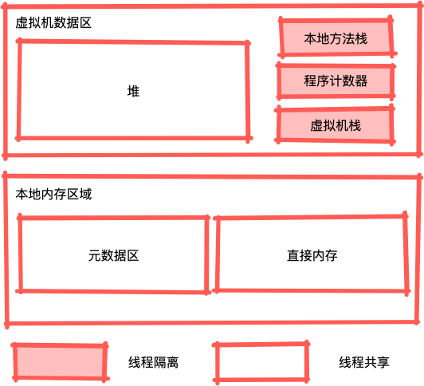
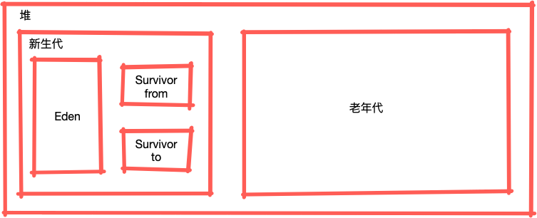

# jdk1.8内存模型

​	JVM内存模型按线程是否共享可分为==**线程共享区域**==与**==线程私有区域==**：

## 一、线程共享区域：

​	即所有线程都共享的区域。

### 1、方法区：

- 方法区为JVM规范中的一部分，不是实际的实现。主要用来存放**已被虚拟机加载的类信息、常量、静态变量、即时编译器（JIT）编译后的代码**等数据。

- JVM规范没有要求在方法区中使用垃圾回收，因为回收效率太低。
- 常量池：存放编译器生成的各种字面量和符号引用，在类加载后放到运行时常量池中。	

### 2、java堆

- 是JVM内存模型中最大的一块区域，是大部分类实例、对象、数组分配内存的区域。

- JVM规范没有限制对象实例只能在 java堆分配，所以会出现逃逸分析的技术。

- 逃逸分析技术：

  ​	**逃逸：**是指在某个方法之内创建的对象除了在方法体之内被引用之外，还在方法体之外被其它变量引用到；这样带来的后果是在该方法执行完毕之后，该方法中创建的对象将无法被GC回收(被其他变量引用)，导致其所占用内存无法得到及时回收，即称为逃逸。

  ​	**逃逸分析技术：**可以分析出某个对象是否永远只在某个方法、线程的范围内，并没有“逃逸”出这个范围，逃逸分析的一个结果就是对于某些未逃逸对象可以直接在栈上分配提高对象分配回收效率，对象占用的空间会随栈帧的出栈而销毁。

- java堆内存分配：

  

  1. 新生代：

    - 进入条件：

      优先选择在新生代的Eden区被分配。

    - 细分：

      - Eden
      - Survivor
      - 默认 Eden 与 survivor 的比例是 ==8:1==。

  2. 老年代：

    - 进入条件：
      1. 大对象，-XX:PretenureSizeThreshold 大于这个参数的对象直接在老年代分配，来避免新生代GC以及分配担保机制和Eden与Survivor之间的复制。
      2. 经过第一次Minor GC仍然存在，能被Survivor容纳，就会被移动到Survivor中，此时年龄为1，当年龄大于预设值就进入老年代。
      3. 如果Survivor中相同年龄的所有对象大小的总和大于Survivor空间的一半，年龄大于等于该年龄的对象进入老年代。
      4. 如果Survivor空间无法容纳新生代中Minor GC之后还存活的对象，则无法容纳的对象进入老年代。

- TLAB：

  ​	JVM在内存新生代Eden Space中开辟了一小块线程私有的区域TLAB（Thread-local allocation  buffer）。在Java程序中很多对象都是小对象且用过即丢，它们不存在线程共享也适合被快速GC，所以对于小对象通常JVM会优先分配在TLAB上，并且TLAB上的分配由于是线程私有，所以没有锁开销。

  也就是说，**Java中每个线程都会有自己的缓冲区称作TLAB，在对象分配的时候不用锁住整个堆，而只需要在自己的缓冲区分配即可。**

## 二、线程私有(隔离)区域

​	即每个线程都会有一块私有的数据区。

### 1、程序计数器(PC寄存器)：

- JVM中一块内存较小的区域。
- 用以保证任意时刻一个线程只会执行一个方法的代码，如果不是native的，就存放当前正在执行的字节码指令的地址，如果是native，则是undefined。

### 2、虚拟机栈

- 与线程同时创建，生命周期与线程相同。

- 虚拟机栈描述的是 java 方法执行的内存模型，每个方法在执行的同时都会创建一个 ==栈帧(Stack Frame)==，

  用以存储==局部变量表、操作数栈、动态链接、方法出口==等信息。

- **每个方法从调用到执行完成的过程就对应着一个栈帧在虚拟机栈中从入栈到出栈的过程。**
- 局部变量表：用以存储编译期可知的各种**基本数据类型**（boolean、byte、char、short、int、float、long、double）、**对象引用**和**ReturnAddress类型**。

### 3、本地方法栈

- 功能与虚拟机栈相同，只是虚拟机栈为java方法服务，而本地方法栈为native方法服务。

## 三、jdk1.8与JVM规范中的区别

### 1、直接内存

​	非Java标准，是JVM以外的本地内存，在Java4出现的NIO中，**为了防止Java堆和Native堆之间往复的数据复制带来的性能损耗，以提高IO性能**，此后NIO可以使用Native方法直接在Native堆分配内存。JDK中有一种基于通道（Channel）和缓冲区（Buffer）的内存分配方式，将由C语言实现的native函数库分配在直接内存中，用存储在JVM堆中的DirectByteBuffer来引用。

### 2、元数据区（方法区的实现）

​	Java7以及之前是使用的永久代来实现方法区，大小是在JVM启动时固定的，设得太小程序在运行时容易出现永久代OOM，设得太大又挤压了Java堆的内存，难以选择。所以，==Java8中用元空间替代了永久代来实现方法区，**元空间并不在虚拟机中，而是使用本地内存，并且大小可以是自动增长的，这样减少了方法区OOM的可能性。**==元空间存储 JIT 即时编译后的native代码，可能还存在短指针数据区CCS。

### 3、堆区：

 	Java7时，运行时常量池从方法区移到了堆区，为Java8移除永久带的做好准备。

# JVM垃圾回收机制

## 一、判断对象是否存活（需要回收）

### 1、引用计数法

​	由于无法解决对象间的相互引用问题，已经很少被使用。

### 2、可达性分析算法：

​	通过一系列的GC Roots的对象作为起点，从这些节点开始向下搜索，搜索所走过的路径称为引用链，当一个对象到GC Roots没有与任何引用链相连时，则说明此对象是不可用的，即不可达的。

- GC Root：

  ​	可作为 GC Root 的对象有：

  ​		虚拟机栈(主要是栈帧中的局部变量表)中引用的对象。

  ​		方法区中静态变量引用的对象。

  ​		方法区中常量引用的对象。

  ​		本地方法栈 JNI（即 Native方法）引用的对象。

- 判断对象真正死亡：

  要宣告一个对象真正死亡至少需要经过**两次标记**：

  1. 对象经过可达性分析后没有与任何 GC Roots 链连接。（被标记筛选）

     ​	筛选条件：

     ​		是否有必要执行finalize() 方法？

     ​			-是：对象有覆盖 finalize() 方法且 finalize() 方法没有被执行过。

     ​			-否：将被GC清除。

  2. 在finalize()方法中没有逃脱回收（没有将自身与GC Root链上的对象建立连接），这是对第一次标记的清理。

## 二、如何回收（分代回收）

​	新生代因为每次GC都有大批对象死去，只需要付出少量存活对象的复制成本且无碎片所以使用==“复制算法”==。

老年代因为存活率高、没有分配担保空间，所以使用==“标记-清除”==或者==“标记-整理”==算法

**复制算法：**

​	将可用内存划分为相等的两块，分配内存时只使用其中的一块，每次GC后，将还存活的对象移到没有被使用的那一块上，然后清除已被使用的内存块。此算法不会产生内存碎片，但每次都要预留一般的内存，损失也太大了。

​	Java8中的使用：将可用内存按容量划分为Eden、from survivor、to survivor，对象分配的时候使用Eden和一个survivor，Minor GC后将存活的对象复制到另一个survivor，然后将原来已使用的内存一次清理掉。这样没有内存碎片。

**标记-清除：**

​	首先标记出所有需要回收的对象，标记完成后统一回收被标记的对象。标记-清除算法有个弊端，即每次GC后都会会产生大量的内存碎片，以后可能会导致无法为大对象分配内存，从而频繁触发GC，大幅降低系统性能。

**标记-整理：**

​	首先标记出所有需要回收的对象，让所有存活的对象向一端移动，再统一收回另一端的空间，该算法没有产生内存碎片，但需要担负移动对象时的开销。

## 三、GC类型及其触发条件

- Minor GC：

  ​	当Eden区空间不足以继续分配对象时，发起Minor GC，该 GC 只回收 Eden 区的内存。

- Major GC：

  ​	老年代空间不足，发起 Major GC，只回收老年代的内存。但一般发起Major GC时也要发起Minor GC，所以JVM会直接发起一次 Full GC，故Major GC比较少见。注：**老年代在Java8中已被元空间代替**。

- Full GC:

  1. 调用System.gc时，系统建议执行Full GC，但是不必然执行.
  2. 老年代空间不足（通过Minor GC后进入老年代的大小大于老年代的可用内存）。
  3. 方法区空间不足。

## 四、垃圾收集器

### 1、串行收集器（Serial）

- 串行收集器Serial是最古老的收集器，只使用一个线程去回收，可能会产生较长的停顿（Stop the World）。
- 新生代使用Serial收集器（`复制算法`）、老年代使用Serial Old（`标记-整理算法`）。
- 参数：`-XX:+UseSerialGC`，默认开启`-XX:+UseSerialOldGC`

### 2、并行收集器（Parallel）

- ParNew（新生代）

  ​	ParNew垃圾收集器是Serial收集器的多线程版本。

- Parallel Scavenge（新生代）
  - 并行收集器Parallel关注**可控的吞吐量**，能==精确地控制吞吐量与最大停顿时间==是该收集器最大的特点，也是1.8的Server模式的默认收集器，使用多线程收集。
  - 新生代`复制`算法、老年代`标记-整理`算法。
  - 参数：`-XX:+UseParallelGC`，默认开启`-XX:+UseParallelOldGC`
  - 注：**Parallel Scavenge无法与CMS配合工作**。
- Parallel Old（老年代）

  - 多线程、标记整理、关注吞吐量。

### 3、并发收集器（CMS、G1）

- 串行、并行、并发的区别：
  - 串行：只能单一垃圾收集线程执行任务，**用户线程处于等待状态**。
  - 并行：多垃圾收集线程**==同时执行==**任务，**但用户线程仍处于等待状态**。
  - 并发：多垃圾收集线程**==共同执行==**任务，但不一定是并行的，可能是交替执行，**用户线程可继续运行**。

- CMS（老年代）：
  - 并发收集器CMS是以==**最短停顿时间**==为目标的收集器，只负责老年代的垃圾收集。
  - CMS针对老年代，收集步骤如下：
    - 初始标记（CMS initial mark）：==停顿，串行，时间短。==
    - 并发标记（CMS concurrent mark）：==不停顿，并发，时间较长。==
    - 重新标记（CMS remark）：==停顿，串行，时间稍长==
    - 并发清除（CMS concurrent sweep）：==不停顿，并发，时间长==
  - CMS使用`标记-清除`算法，所以会产生内存碎片。
  - 参数：`-XX:+UseConcMarkSweepGC`，默认开启`-XX:+UseParNewGC`
  - 优点：并发收集、低停顿(Stop The World)。
  - 缺点：
    - 对CPU资源很敏感。
    - 无法处理浮动垃圾。
    - 基于`标记-清除`算法，会产生内存碎片。

    **浮动垃圾：**即CMS在并发清理阶段，用户线程还在继续运行着，只要用户线程还在运行就可能产生新的垃圾，因为这些垃圾是在CMS标记之后产生的，所以CMS无法在单次清除中回收掉这些垃圾，只能留给下一次GC来处理，这部分垃圾就称为浮动垃圾。
- G1（新生代、老年代）：
  - G1关注能在回收大部分内存的前提下==精确控制**停顿时间**且垃圾回收效率高==。
  - **G1将堆划分为多个大小固定的独立区域，根据每次允许的收集时间优先回收垃圾最多的区域，使用`标记-整理`算法，是jdk1.9的Server模式的默认收集器。**
  - `-XX:+UseG1GC`
  - 特点：**并发并行**、**分代收集**、**空间整合**、**可预测的停顿**。
  - 收集步骤：
    - 初始标记（Initial Marking）：==停顿，串行，耗时很短==。
    - 并发标记（Concurrent Marking）：==不停顿，可并发，耗时较长。==
    - 最终标记（Final Marking）：==停顿，可并行，耗时短。==
    - 筛选回收（Live Data Counting and Evacuation）：==默认停顿（时间短），以提高收集效率，但可并发（时间稍长、不需要停顿）。==

### 4、如何选择垃圾收集器

1. 需要停顿时间能超过1秒且想要一个可控的吞吐量时，使用并行收集器。
2. 如果停顿时间重要且不超过1秒，使用并发收集器。
3. 如果内存小于100M，使用串行或者JVM自己选。
4. 如果是单核，且没有系统停顿要求，使用串行或者JVM自己选

### 5、Stop The World

Java中Stop-The-World机制简称STW，是在执行垃圾收集算法时，Java应用程序的其他所有线程都被挂起。Java中一种全局暂停现象，==全局停顿，所有Java代码停止，native代码可以执行，但不能与JVM交互==。

STW总会发生，不管是新生代还是老年代，比如CMS在初始标记和重复标记阶段会停顿，G1在初始标记阶段也会停顿，所以并不是选择了一款停顿时间低的垃圾收集器就可以避免STW的，我们只能尽量去减少STW的时间。

那么为什么一定要STW？

​	因为在定位堆中的对象时JVM会记录下对所有对象的引用，如果在定位对象过程中，有新的对象被分配或者刚记录下的对象突然变得无法访问，就会导致一些问题，比如部分对象无法被回收，更严重的是如果GC期间分配的一个GC  Root对象引用了准备被回收的对象，那么该对象就会被错误地回收。

# JVM类加机制

**JVM类加载机制：**

​	虚拟机把描述类的数据从 Class 文件**加载**到内存，并对数据进行**效验、转换、解析**和**初始化**，使其最终形成可以被虚拟机直接使用的 Java 类型的过程。

**类的生命周期：**

​	类从被加载到虚拟机内存开始，到卸载出内存为止。类的整个生命周期可分为：**加载（Loading）、验证（Verification）、准备（Preparation）、解析（Resolution）、初始化（initialization）、使用（Using）、和卸载（Unloading）**7个阶段。

## 一、类加载过程

1. 加载（获取来自**任意来源**的字节流，并将其转换成方法区运行时的数据结构，生成Class对象）。
2. 验证（保证字节流信息符合当前虚拟机的要求，防止被篡改过的字节码危害虚拟机的安全）。
3. 准备（为类变量【static修饰的变量】分配内存并设置初始值，**==若被final修饰，则设置为final指定的值==**）。
4. 解析（将常量池的符号引用替换为直接引用，符号引用是用一组符号来描述所引用的目标，直接引用是**指向目标的指针、相对偏移量和可间接定位到目标的句柄**）。
5. 初始化（执行类构造器、类变量赋值、静态语句块）。

## 二、初始化时机

### 1、时机

1. 遇到 **==new、getstatic、putstatic、invokestatic==** 指令时，如new一个对象及静态字段/方法被使用的场景。
2. 使用java.lang.reflect包对类进行反射调用时。
3. 如果被初始化的类的父类没有被初始化，先初始化父类。
4. 程序执行入口，即执行main()方法时，main() 方法所在的类需要先初始化。
5. 使用动态语言支持时（JDK1.7及以后），如java.lang.invoke.MethodHandle实例最后的解析结果为：REF_getStatic、REF_putStatic、REF_invokeStatic的方法句柄，若这些方法句柄所对应的类还未初始化，需先触发其初始化。

**总结：以上5种情况称为对一个类的==主动引用==，除此之外都是==被动引用==。==主动引用时==若类还未初始化过，则需先触发其初始化。**

### 2、细节

1. 引用一个类的**==静态字段==**，只有**==直接定义==**这个字段的类才会触发初始化。

2. 通过定义一个类的**==数组==**来引用该类，**==不会触发==**该类的初始化。

3. 引用一个类的**==常量==**不会触发该类的初始化。

   常量在**编译阶段**会直接存入**调用（者）类的常量池中**，本质上没有引用到定义该常量的类，故不会触发其初始化。

## 三、类加载器

- 启动类加载器（BootStrap ClassLoader）：

  ​	用C++语言实现，是虚拟机自身的一部分，它负责加载 <JAVA_HOME>/lib路径下的核心类库（如rt.jar），无法被Java程序直接引用。

- 扩展类加载器（Extension ClassLoader）：

  ​	用Java语言实现，它负责加载<JAVA_HOME>/lib/ext目录下或者由系统变量-Djava.ext.dir指定位路径中的类库，开发者可直接使用该类加载器。

- 应用程序/系统类加载器（Application ClassLoader）：

  ​	用Java语言实现，它负责加载用户类路径ClassPath上指定的类库，开发者可直接使用该类加载器。

## 四、双亲委派模型

- 定义：

  ​	每个类加载器在收到类加载请求时，**==都不会自己先加载，而是将该请求委派给父类加载器去完成==**，若父类加载器可以完成该类的加载请求任务，就成功返回，若父类加载器无法完成此加载任务，子加载器才会尝试自己去加载，这就是**双亲委派模式**。

- 优点：

  ​	采用双亲委派模式可使Java类随着它的类加载器一起具备了一种带有优先级的层次关系，通过这种层级关系**==可以避免类的重复加载==**，当父加载器已经加载了该类时，就没有必要让子ClassLoader再加载一次。其次还可以**==防止子类加载器加载的类恶意覆盖Java核心API==**。

- 三次大型破坏双亲委派模式的事件： 

  1. JDK1.2时，为类加载器添加了findClass()方法。因为在双亲委派模式出来之前，用户继承ClassLoader就是为了重写loadClass()方法，但双亲委派模式需要这个方法，所以它不能被用户随意重写。

  2. Java团队添加了一个**线程上下文加载器**，为了解决基础类要调回用户的代码的问题。如JNDI/JDBC需要调用ClassPath下用户的代码来进行资源管理，如果该加载器没有被设置过，那么就默认是应用程序类加载器【applicationClassLoad】。

     **线程上下文加载器**的作用：**==可让父类加载器请求子类加载器去完成类加载的动作==**，这显然是违背了双亲委派的准则。

  3. 为了实现代码热替换。OSGi为了实现自己的类加载逻辑，**用平级查找的逻辑替换掉了双亲委派模式向下传递的逻辑**。但其实可以不破坏双亲委派逻辑而是自定义类加载器来达到代码热替换。比如[这篇文章](https://www.cnblogs.com/pfxiong/p/4070462.html)