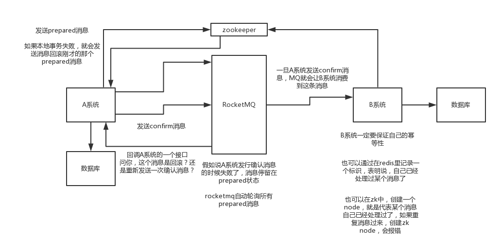
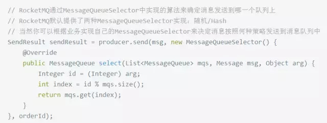
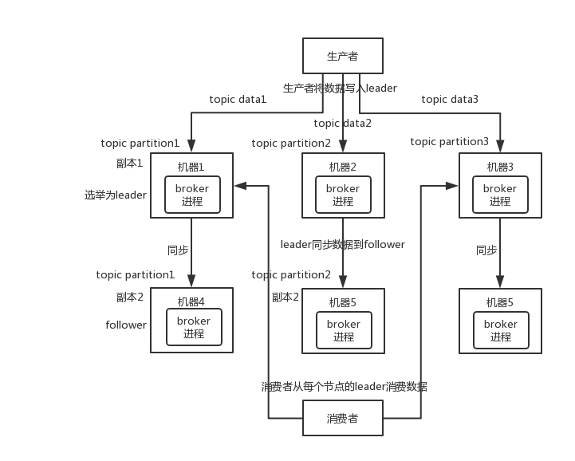
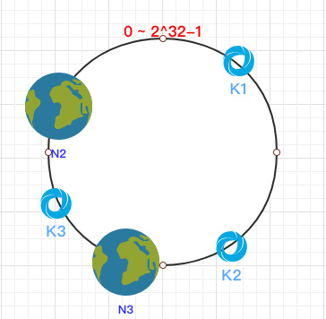
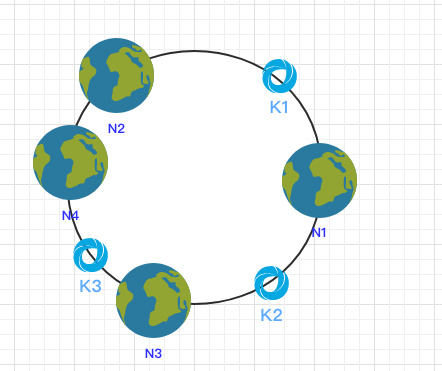
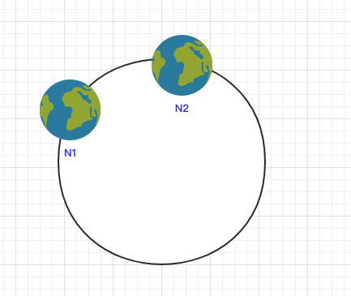
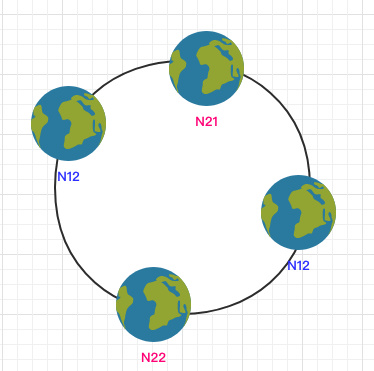

# 一、分布式

## 1、分布式与集群

- **分布式：**

  ​	将不同的服务模块（工程）分散部署在多台不同的服务器上，各模块之间通过Rpc/Rmi或Restful Api 进行通信和调用，对外提供服务和组内协作。

- **集群：**

  ​	将相同的模块分散部署在多台不同的服务器上，通过分布式调度软件进行统一的调度，对外提供服务和访问。

## 2、CAP理论

CAP原则又称CAP定理，指的是在一个分布式系统中，Consistency（一致性）、 Availability（可用性）、Partition tolerance（分区容错性），**==三者不可兼得，最多只能实现两种==**。

分布式系统的CAP理论：理论首先把分布式系统中的三个特性进行了如下归纳：

- 一致性（C）：**在分布式系统中的所有数据备份，在同一时刻都是同样的值**。（即同一时间访问所有节点的同一数据，其值是相同的）。
- 可用性（A）：**系统服务总是可用的，对用户的每一个操作总是==能在有限的时间内返回结果==**。
  - **有限的时间**：指的是在一个系统设计之初就设定好的系统运行指标，超过这个时间即表示服务不可用。
  - **返回结果**：要求系统在完成用户请求的处理后，返回一个正常响应的结果，即操作成功或失败，而不能返回一个让用户感到困惑的结果。
- 分区容错性（P）：**分布式系统在==遇到任何网络分区故障==的时候，仍能对外提供满足一致性和可用性的服务，除非是整个网络环境都发生了故障。**即在分布式集群中一部分节点故障后，集群整体还能继续响应客户端的读写请求。

CAP理论就是说在分布式存储系统中，最多只能实现上面的两点。**而由于当前的网络硬件肯定会出现延迟和丢包等问题，所以==分区容错性是我们必须需要实现的==**，所以剩下的只能从C与A里选。

## 3、CAP个人理解

如果选择一致性，则需要将数据同步更新到所有节点上，每次写操作就都要等待全部节点写成功，会导致可用性的降低。
如果选择可用性，就需要将数据复制到很多个节点，需要复制的数据很多，复制的过程缓慢，会导致一致性的降低。

BASE理论：

- 基本可用（Basically Available）
- 软状态（Soft state）
- 最终一致（Eventually consistent）

BASE理论的核心思想是：**即使无法做到强一致性，但每个应用都可以根据自身业务特点，采用适当的方式来使系统达到==最终一致性==。**

# 二、分布式锁

## 1、为什么用？

**在分布式环境中，需要一种跨JVM的互斥机制来控制共享资源的访问。**

例如，为避免用户操作重复导致交易执行多次，使用分布式锁可以将第一次以外的请求在所有服务节点上立马取消掉。如果使用事务在数据库层面进行限制也能实现的但会增大数据库的压力。

例如，在分布式任务系统中为避免同一任务重复执行，某个节点执行任务之后可以使用分布式锁避免其他节点在同一时刻得到任务。

## 2、如何实现？

### 1、基于数据库

在数据库中创建一个表，表中包含**方法名**等字段，**并在方法名字段上创建唯一索引**，想要执行某个方法，就使用这个方法名向表中插入数据，成功插入则表示获取锁，执行完成后删除对应的行数据表示释放锁。

```mysql
DROP TABLE IF EXISTS `method_lock`;
CREATE TABLE `method_lock` (
  `id` int(11) unsigned NOT NULL AUTO_INCREMENT COMMENT '主键',
  `method_name` varchar(64) NOT NULL COMMENT '锁定的方法名',
  `desc` varchar(255) NOT NULL COMMENT '备注信息',
  `update_time` timestamp NOT NULL DEFAULT CURRENT_TIMESTAMP ON UPDATE CURRENT_TIMESTAMP,
  PRIMARY KEY (`id`),
  UNIQUE KEY `uidx_method_name` (`method_name`) USING BTREE
) ENGINE=InnoDB AUTO_INCREMENT=3 DEFAULT CHARSET=utf8 COMMENT='锁定中的方法';
```

执行某个方法后，插入一条记录

```mysql
INSERT INTO method_lock (method_name, desc) VALUES ('methodName', '测试的methodName');
```

因为我们对method_name做了唯一性约束，这里如果有多个请求同时提交到数据库的话，数据库会保证只有一个操作可以成功，那么我们就可以认为操作成功的那个线程获得了该方法的锁，可以执行方法体内容。

成功插入则获取锁，执行完成后删除对应的行数据释放锁：

```mysql
delete from method_lock where method_name ='methodName';
```

优点：易于理解与实现

缺点：

1. 没有锁失效自动删除机制，因为有可能出现成功插入数据后，服务器宕机了，对应的数据没有被删除，当服务恢复后一直获取不到锁，所以，**需要在表中新增一列，用于记录失效时间，并且需要有定时任务清除这些失效的数据。**
2. 吞吐量很低，加大数据库压力。
3. 单点故障问题。
4. 轮询获取锁状态方式太过低效。

### 2、基于Redis

`NX`是Redis提供的一个**==原子操作==**，如果指定key存在，那么`NX`失败，如果不存在会进行set操作并返回成功。我们可以利用这个来实现一个分布式的锁，主要思路就是，set成功表示获取锁，set失败表示获取失败，失败后需要重试，且`EX`或`PX`参数可以让该key在超时之后自动删除。

`NX ` ：只有 key 不存在时，设置key的值才能成功。

`XX`：只有key存在时，设置key的值才能成功。

`EX second` ：可设置一个key在 second 秒后自动失效。

`PX milliseconds` :可设置一个key在 milliseconds 毫秒后自动失效。

`SET key value NX PX 2000`：当key不存在时，设置一个key的值为value，并使其在2秒自动失效。

```java
public void lock(String key, String request, int timeout) throws InterruptedException {
    Jedis jedis = jedisPool.getResource();

    while (timeout >= 0) {
        String result = jedis.set(LOCK_PREFIX + key, request, SET_IF_NOT_EXIST, SET_WITH_EXPIRE_TIME, DEFAULT_EXPIRE_TIME);
        if (LOCK_MSG.equals(result)) {
            jedis.close();
            return;
        }
        Thread.sleep(DEFAULT_SLEEP_TIME);
        timeout -= DEFAULT_SLEEP_TIME;
    }
}
```

优点：

1. 吞吐量高。
2. 有锁失效自动删除机制，保证不会阻塞所有流程。

缺点:

1. 单点故障问题。
2. 锁超时问题：如果A拿到锁之后设置了超时时长，但是业务还未执行完成且锁已经被释放，此时其他进程就会拿到锁从而执行相同的业务。
3. 轮询获取锁状态方式太过低效。

[**Redis分布式锁**](https://doocs.github.io/advanced-java/#/docs/distributed-system/distributed-lock-redis-vs-zookeeper?id=redis-%E5%88%86%E5%B8%83%E5%BC%8F%E9%94%81)

### 3、基于ZooKeeper

1. 当客户端对某个方法加锁时，在Zookeeper上的与该方法对应的指定节点的目录下，生成一个临时有序节点。
2. 判断该节点是否是当前目录下最小的节点，如果是则获取成功；如果不是，则获取失败，并获取上一个临时有序节点，对该节点进行监听，当节点删除时通知唯一的客户端。

优点：

1. 解决锁超时问题。因为Zookeeper的写入都是顺序的，在一个节点创建之后，其他请求再次创建便会失败，同时可以对这个节点进行Watch，如果节点删除会通知其他节点抢占锁。
2. 能通过watch机制高效通知其他节点获取锁，避免惊群效应。
3. 有锁失效自动删除机制，保证不会阻塞所有流程。

缺点：

1. 性能不如Redis。
2. 强依赖zk，如果原来系统不用zk那就需要维护一套zk。

[**面试心德-分布式锁**](https://doocs.github.io/advanced-java/#/docs/distributed-system/distributed-lock-redis-vs-zookeeper)

# 三、分布式事物

## 1、两阶段提交方案【XA方案】

所谓的 XA 方案，即：两阶段提交，需有一个**事务管理器**的概念，用以负责协调多个数据库（资源管理器）的事务。

**第一段：询问。**即事务管理器先问问各个数据库是否已准备好？

**第二阶段：执行。**即如果每个数据库都回复 ok，那么就正式提交事务，在各个数据库上执行操作；如果其中任何一个数据库回答no，那么就回滚事务。

​	这种分布式事务方案，**比较适合用在单块应用里，但又跨多个库的分布式事务**，而且因为严重依赖于数据库层面来搞定复杂的事务，效率很低，绝对不适合高并发的场景。如果要玩儿，那么基于 `Spring + JTA` 就可以搞定，自己随便搜个 demo 看看就知道了。

​	这个方案，我们很少用，一般来说**某个系统内部如果出现跨多个库**的这么一个操作，是**不合规**的。我可以给大家介绍一下， 现在微服务，一个大的系统分成几十个甚至几百个服务。一般来说，我们的规定和规范，是要求**每个服务只能操作自己对应的一个数据库**。

​	如果你要操作别的服务对应的库，不允许直连别的服务的库，否则违反微服务架构的规范，你随便交叉胡乱访问，几百个服务的话，全体乱套了，这样的一套服务是没法管理的，没法治理的，可能会出现数据被别人改错，自己的库被别人写挂等情况。

如果你要操作别人的服务的库，你必须是通过**调用别的服务的接口**来实现，绝对不允许交叉访问别人的数据库。


## 2、TCC 方案

TCC 的全称是：Try、Confirm、Cancel。

- Try【尝试】阶段：这个阶段说的是**对各个服务的资源做检测以及对资源进行==锁定或者预留==。**
- Confirm【确认】阶段：这个阶段说的是**在各个服务中执行==实际的操作==。**
- Cancel【取消】阶段：**如果任何一个服务的业务方法执行出错，那么这里就需要进行==补偿（回滚）==**，就是对已经执行成功的业务逻辑进行回滚操作。（把那些执行成功的回滚）

这种方案说实话几乎很少人使用，我们用的也比较少，但是也有使用的场景。因为这个**事务回滚**实际上是**严重依赖于你自己写代码来回滚和补偿**，会造成补偿代码巨大，非常之恶心。

比如说我们，一般来说跟**钱**相关的，跟钱打交道的，**支付**、**交易**相关的场景，我们会用 TCC，严格保证分布式事务要么全部成功，要么全部自动回滚，严格保证资金的正确性，保证在资金上不会出现问题。而且最好是你的各个业务执行的时间都比较短。

但是说实话，一般尽量别这么搞，自己手写回滚逻辑，或者是补偿逻辑，实在太恶心了，那个业务代码很难维护。


## 3、本地消息表

本地消息表其实是国外的 ebay 搞出来的这么一套思想。

这个大概意思是这样的：

1. A 系统在自己本地一个事务里操作同时，插入一条数据到消息表；
2. 接着 A 系统将这个消息发送到 MQ 中去；
3. B 系统接收到消息之后，在一个事务里，往自己本地消息表里插入一条数据，同时执行其他的业务操作，如果这个消息已经被处理过了，那么此时这个事务会回滚，这样**保证不会重复处理消息**；
4. B 系统执行成功之后，就会更新自己本地消息表的状态以及 A 系统消息表的状态；
5. 如果 B 系统处理失败了，那么就不会更新消息表状态，那么此时 A 系统会定时扫描自己的消息表，如果有未处理的消息，会再次发送到 MQ 中去，让 B 再次处理；
6. 这个方案保证了最终一致性，哪怕 B 事务失败了，但是 A 会不断重发消息，直到 B 那边成功为止。

这个方案说实话最大的问题就在于**严重依赖于数据库的消息表来管理事务**啥的，会导致如果是高并发场景咋办呢？咋扩展呢？所以一般确实很少用。


## 4、可靠消息最终一致性方案

这个的意思，就是干脆不要用本地的消息表了，直接基于 MQ 来实现事务。比如阿里的 RocketMQ 就支持消息事务。

大概的意思就是：

1. A 系统先发送一个 prepared 消息到 mq，如果这个 prepared 消息发送失败那么就直接取消操作别执行了；
2. 如果这个消息发送成功过了，那么接着执行本地事务，如果成功就告诉 mq 发送确认消息，如果失败就告诉 mq 回滚消息；
3. 如果发送了确认消息，那么此时 B 系统会接收到确认消息，然后执行本地的事务；
4. mq 会自动**定时轮询**所有 prepared 消息回调你的接口，问你，这个消息是不是本地事务处理失败了，所有没发送确认的消息，是继续重试还是回滚？一般来说这里你就可以查下数据库看之前本地事务是否执行，如果回滚了，那么这里也回滚吧。这个就是避免可能本地事务执行成功了，而确认消息却发送失败了。
5. 这个方案里，要是系统 B 的事务失败了咋办？重试咯，自动不断重试直到成功，如果实在是不行，要么就是针对重要的资金类业务进行回滚，比如 B 系统本地回滚后，想办法通知系统 A 也回滚；或者是发送报警由人工来手工回滚和补偿。
6. 这个还是比较合适的，目前国内互联网公司大都是这么玩儿的，要不你举用 RocketMQ 支持的，要不你就自己基于类似 ActiveMQ？RabbitMQ？自己封装一套类似的逻辑出来，总之思路就是这样子的。



## 5、最大努力通知方案

这个方案的大致意思就是：

1. 系统 A 本地事务执行完之后，发送个消息到 MQ；
2. 这里会有个专门消费 MQ 的**最大努力通知服务**，这个服务会消费 MQ 然后写入数据库中记录下来，或者是放入个内存队列也可以，接着调用系统 B 的接口；
3. 要是系统 B 执行成功就 ok 了；要是系统 B 执行失败了，那么最大努力通知服务就定时尝试重新调用系统 B，反复 N 次，最后还是不行就放弃。

## 6、你们公司是如何处理分布式事务的？

如果你真的被问到，可以这么说，我们某某特别严格的场景，用的是 TCC 来保证强一致性；然后其他的一些场景基于阿里的 RocketMQ 来实现分布式事务。

你找一个严格资金要求绝对不能错的场景，你可以说你是用的 TCC 方案；如果是一般的分布式事务场景，订单插入之后要调用库存服务更新库存，库存数据没有资金那么的敏感，可以用可靠消息最终一致性方案。

友情提示一下，RocketMQ 3.2.6 之前的版本，是可以按照上面的思路来的，但是之后接口做了一些改变，我这里不再赘述了。

当然如果你愿意，你可以参考可靠消息最终一致性方案来自己实现一套分布式事务，比如基于 RocketMQ 来玩儿。

[**面试心德-分布式事务**](https://doocs.github.io/advanced-java/#/docs/distributed-system/distributed-transaction)

# 四、消息队列

## 1、优点

1. **==异步化处理，减少请求响应时间==**。

   ​	A 系统接收一个请求，需要在自己本地写库，还需要在 BCD 三个系统写库，自己本地写库要 3ms，BCD 三个系统分别写库要 300ms、450ms、200ms。最终请求总延时是 3 + 300 + 450 + 200 = 953ms，接近 
   1s，用户感觉搞个什么东西，慢死了慢死了。

   ​	一般互联网类的企业，对于用户直接的操作，一般要求是每个请求都必须在 200 ms 以内完成，对用户几乎是无感知的。

   ​	**使用 MQ**后，那么 A 系统连续发送 3 条消息到 MQ 队列中，假如耗时 5ms，A 系统从接受一个请求到返回响应给用户，总时长是 3 + 5 = 8ms，对于用户而言，其实感觉上就是点个按钮，8ms 以后就直接返回了，爽！网站做得真好，真快！

2. **==服务之间解耦。==**主服务只关心核心的流程，其他不重要的、耗费时间流程是否如何处理完成不需要知道，只通知即可。

   ​	看这么个场景。A 系统发送数据到 BCD 三个系统，通过接口调用发送。如果 E 系统也要这个数据呢？那如果 C 系统现在不需要了呢？

   ​	在这个场景中，A 系统跟其它各种乱七八糟的系统严重耦合，A 系统产生一条比较关键的数据，很多系统都需要 A 系统将这个数据发送过来。A 系统要时时刻刻考虑 BCDE 四个系统如果挂了该咋办？要不要重发，要不要把消息存起来等。

   ​	使用 MQ后，A 系统产生一条数据，发送到 MQ 里面去，哪个系统需要数据自己去 MQ 里面消费。如果新系统需要数据，直接从 MQ 里消费即可；如果某个系统不需要这条数据了，就取消对 MQ 消息的消费即可。这样下来，A 系统压根儿不需要去考虑要给谁发送数据，不需要维护这个代码，也不需要考虑人家是否调用成功、失败超时等情况。

3. **==流量削锋。==**对于不需要实时处理的请求来说，当并发量特别大的时候，可以先在消息队列中作缓存，然后陆续发送给对应的服务去处理。

   ​	每天 0:00 到 12:00，A 系统风平浪静，每秒并发请求数量就 50 个。结果每次一到 12:00 ~ 13:00  ，每秒并发请求数量突然会暴增到 5k+ 条。但是系统是直接基于 MySQL 的，大量的请求涌入 MySQL，每秒钟对 MySQL 执行约 5k 条  SQL。

   ​	一般的 MySQL，扛到每秒 2k 个请求就差不多了，如果每秒请求到 5k 的话，可能就直接把 MySQL 给打死了，导致系统崩溃，用户也就没法再使用系统了。

   ​	但是高峰期一过，到了下午的时候，就成了低峰期，可能也就 1w 的用户同时在网站上操作，每秒中的请求数量可能也就 50 个请求，对整个系统几乎没有任何的压力。

   ​	**使用 MQ**后，每秒 5k 个请求写入 MQ，A 系统每秒钟最多处理 2k 个请求，因为 MySQL 每秒钟最多处理 2k 个。A 系统从 MQ 中慢慢拉取请求，每秒钟就拉取 2k 个请求，不要超过自己每秒能处理的最大请求数量就 ok，这样下来，哪怕是高峰期的时候，A 系统也绝对不会挂掉。而 MQ 每秒钟 5k 个请求进来，就 2k 个请求出去，结果就导致在中午高峰期（1 个小时），可能有几十万甚至几百万的请求积压在 MQ 中。

   ​	这个短暂的高峰期积压是 ok 的，因为高峰期过了之后，每秒钟就 50 个请求进 MQ，但是 A 系统依然会按照每秒 2k 个请求的速度在处理。所以说，只要高峰期一过，A 系统就会快速将积压的消息给解决掉。

## 2、缺点

1. 系统可用性降低。

   ​	本来你就是 A 系统调用 BCD 三个系统的接口就好了，人 ABCD 四个系统好好的，没啥问题，你偏加个 MQ 进来，万一 MQ 挂了咋整，MQ 一挂，整套系统崩溃的，你不就完了？如何保证消息队列的高可用，可以[点击这里查看](https://doocs.github.io/advanced-java/#/docs/high-concurrency/how-to-ensure-high-availability-of-message-queues)。

2. 系统复杂度提高。

   加入MQ后，如何保证消息没有重复消费？如何处理消息丢失的情况？如何保证消息传递的顺序性？

3. 数据一致性问题。

   ​	A 系统处理完了直接返回成功了，人都以为你这个请求就成功了；但是问题是，要是 BCD 三个系统那里，BD 两个系统写库成功了，结果 C 系统写库失败了，咋整？你这数据就不一致了。

## 3、消息重复消费问题

1. 消费端处理消息的业务逻辑保持**幂等性**，在消费端实现。
2. **生成消息时，给每一条消息加上一个唯一的ID，利用一张日志表来记录已经处理成功的消息的ID，如果新到的消息ID已经在日志表中，那么就不再处理这条消息。由消息系统实现，也可以由消费端实现。**

**幂等性：**就是用户对于同一操作发起的一次请求或者多次请求的结果是一致的，不会因为多次点击而产生了副作用。举个最简单的例子，那就是支付，用户购买商品使用约支付，支付扣款成功，但是返回结果的时候网络异常，此时钱已经扣了，用户再次点击按钮，此时会进行第二次扣款，返回结果成功，用户查询余额返发现多扣钱了，流水记录也变成了两条……

[**如何保证幂等性？**](https://www.cnblogs.com/leechenxiang/p/6626629.html)

## 4、各消息队列对比

| 特性                     | ActiveMQ                              | RabbitMQ                                           | RocketMQ                                                     | Kafka                                                        |
| ------------------------ | ------------------------------------- | -------------------------------------------------- | ------------------------------------------------------------ | ------------------------------------------------------------ |
| 单机吞吐量               | 万级，比 RocketMQ、Kafka 低一个数量级 | 同 ActiveMQ                                        | 10 万级，支撑高吞吐                                          | 10 万级，高吞吐，一般配合大数据类的系统来进行实时数据计算、日志采集等场景 |
| topic 数量对吞吐量的影响 |                                       |                                                    | topic 可以达到几百/几千的级别，吞吐量会有较小幅度的下降，这是 RocketMQ 的一大优势，在同等机器下，可以支撑大量的 topic | topic 从几十到几百个时候，吞吐量会大幅度下降，在同等机器下，Kafka 尽量保证 topic 数量不要过多，如果要支撑大规模的 topic，需要增加更多的机器资源 |
| 时效性                   | ms 级                                 | 微秒级，这是 RabbitMQ 的一大特点，延迟最低         | ms 级                                                        | 延迟在 ms 级以内                                             |
| 可用性                   | 高，基于主从架构实现高可用            | 同 ActiveMQ                                        | 非常高，分布式架构                                           | 非常高，分布式，一个数据多个副本，少数机器宕机，不会丢失数据，不会导致不可用 |
| 消息可靠性               | 有较低的概率丢失数据                  | 基本不丢                                           | 经过参数优化配置，可以做到 0 丢失                            | 同 RocketMQ                                                  |
| 功能支持                 | MQ 领域的功能极其完备                 | 基于 erlang 开发，并发能力很强，性能极好，延时很低 | MQ 功能较为完善，还是分布式的，扩展性好                      | 功能较为简单，主要支持简单的 MQ 功能，在大数据领域的实时计算以及日志采集被大规模使用 |

## 5、消息丢失问题【Kafka】

### 1、消费端弄丢了数据

​	唯一可能导致消费者弄丢数据的情况是：你消费到了这个消息，然后消费者那边**自动提交了 offset**，让 Kafka 以为你已经消费好了这个消息，但其实你才刚准备处理这个消息，你还没处理，你自己就挂了，此时这条消息就丢了。

​	 **因为Kafka 会自动提交 offset才导致消费端丢失数据，那么==只要关闭自动提交 offset==，在处理完之后自己再手动提交 offset，就可以保证数据不会丢。**但是此时确实还是**可能会有重复消费**，比如你刚处理完，还没提交 offset，结果自己挂了，此时肯定会重复消费一次，自己保证幂等性就好了。

​	生产环境碰到的一个问题，就是说我们的 Kafka 消费者消费到了数据之后是写到一个内存的 queue 里先缓冲一下，结果有的时候，你刚把消息写入内存 queue，然后消费者会自动提交 offset。然后此时我们重启了系统，就会导致内存 queue 里还没来得及处理的数据就丢失了。

### 2、Kafka 弄丢了数据

这块比较常见的一个场景，就是 Kafka 某个 broker 宕机，然后重新选举 partition 的 leader。大家想想，要是此时其他的 follower 刚好还有些数据没有同步，结果此时 leader 挂了，然后选举某个 follower 成 leader 之后，不就少了一些数据？这就丢了一些数据啊。

生产环境也遇到过，我们之前也是 Kafka 的 leader 机器宕机了，将 follower 切换为 leader 之后，就会发现说这个数据就丢了。

所以此时一般是要求起码设置如下 4 个参数：

- 给 topic 设置 `replication.factor` 参数：这个值必须大于 1，即要求每个 partition 必须有至少 2 个副本。
- 在 Kafka 服务端设置 `min.insync.replicas` 参数：这个值必须大于 1，这个是要求一个 leader 至少感知到有至少一个 follower 还跟自己保持联系，没掉队，这样才能确保 leader 挂了还有一个 follower 。
- 在 producer 端设置 `acks=all`：这个是要求每条数据，必须是**写入所有 replica 之后，才能认为是写成功了**。【保证消息数据一致性，防止选leader时弄丢数据，同时也保证了生产者不会丢失消息】
- 在 producer 端设置 `retries=MAX`（很大很大很大的一个值，无限次重试的意思）：这个是**要求一旦写入失败，就无限重试**，卡在这里了。

**总结：**

1. **==设置`replication.factor=2，`为每个partition至少设有两个replica；==**
2. ==**设置`min.insync.replicas=2`，保证每一个leader，至少要有一个follower；（replicas：所有的副本，包含leader）**==
3. ==**在producer端设置`acks=all`，即每次都要同步好所有的replica后，才能算是写成功；**==
4. ==**在 producer 端设置 `retries=MAX`，即生产者生产的消息在写入Kafka失败时，会无需重试。**==

我们生产环境就是按照上述要求配置的，这样配置之后，至少在 Kafka broker 端就可以保证在 leader 所在 broker 发生故障，进行 leader 切换时，数据不会丢失。

### 3、生产者会不会弄丢数据？

如果按照上述的思路设置了 `acks=all`和`retries=MAX`，一定不会丢，要求是，你的 leader 接收到消息，所有的 follower 都同步到了消息之后，才认为本次写成功了。如果没满足这个条件，生产者会自动不断的重试，重试无限次。

## 6、消息顺序性

消息有序指的是**可以按照消息的发送顺序来消费**。例如：一笔订单产生了 3 条消息，分别是订单创建、订单付款、订单完成。消费时，要按照顺序依次消费才有意义。

消息体通过hash分派到队列里，每个队列对应唯一一个消费者。比如下面的示例中，订单号相同的消息会被先后发送到同一个队列中：



在获取到路由信息以后，会根据MessageQueueSelector实现的算法来选择一个队列，同一个订单号获取到的肯定是同一个队列。

## 7、Kafka 的高可用性

​	Kafka 一个最基本的架构认识：**Kafka由多个 broker 组成，每个 broker 是一个节点；每创建一个 topic，这个 topic 可以划分为多个 partition，每个 partition 可以存在于不同的 broker 上，每个 partition 存放一部分数据，每个 partition 的数据都会同步到其它机器上，形成自己的多个 replica 副本。所有 replica 会选举一个 leader 出来，那么生产和消费都跟这个 leader 打交道，然后其他 replica 就是 follower。写的时候，leader 会负责把数据同步到所有 follower 上去，读的时候就直接读 leader 上的数据即可。**

如果某个 broker 宕机了，没事儿，那个 broker上面的 partition 在其他机器上都有副本的，如果这上面有某个 partition 的 leader【就是说leader挂了】，那么此时会从 follower 中重新选举一个新的 leader 出来，大家继续读写那个新的 leader 即可。这就有所谓的高可用性了。



​	[**互联网高级架构-消息队列**](https://github.com/doocs/advanced-java#%E6%B6%88%E6%81%AF%E9%98%9F%E5%88%97)

​	[**各个消息中间件的对比**](https://doocs.github.io/advanced-java/#/docs/high-concurrency/why-mq?id=kafka%E3%80%81activemq%E3%80%81rabbitmq%E3%80%81rocketmq-%E6%9C%89%E4%BB%80%E4%B9%88%E4%BC%98%E7%BC%BA%E7%82%B9%EF%BC%9F)

# 五、协调器【Zookeeper】

## 1、分布式协调

这个其实是 zookeeper 很经典的一个用法，简单来说，就好比，你 A 系统发送个请求到 mq，然后 B 系统消息消费之后处理了。那 A 系统如何知道 B 系统的处理结果？用 zookeeper 就可以实现分布式系统之间的协调工作。A 系统发送请求之后可以在 zookeeper 上**对某个节点的值注册个监听器**，一旦 B 系统处理完了就修改 zookeeper 那个节点的值，A 立马就可以收到通知，完美解决。


## 2、分布式锁

举个栗子。对某一个数据连续发出两个修改操作，两台机器同时收到了请求，但是只能一台机器先执行完另外一个机器再执行。那么此时就可以使用 zookeeper 分布式锁，一个机器接收到了请求之后先获取 zookeeper 上的一把分布式锁，就是可以去创建一个 znode，接着执行操作；然后另外一个机器也**尝试去创建**那个 znode，结果发现自己创建不了，因为被别人创建了，那只能等着，等第一个机器执行完了自己再执行。


## 3、元数据/配置信息管理

zookeeper 可以用作很多系统的配置信息的管理，比如 kafka、storm 等等很多分布式系统都会选用 zookeeper 来做一些元数据、配置信息的管理，包括 dubbo 注册中心不也支持 zookeeper 么？


## 4、HA高可用性

这个应该是很常见的，比如 hadoop、hdfs、yarn 等很多大数据系统，都选择基于 zookeeper 来开发 HA 高可用机制，就是一个**重要进程一般会做主备**两个，主进程挂了立马通过 zookeeper 感知到切换到备用进程。


# 六、ID生成方式

## 1、UUID

优：

1. 本地生成没有了网络之类的消耗，效率非常高

缺：

1. 不易于存储：UUID太长，16字节128位，通常以36长度的字符串表示，很多场景不适用。
2. 信息不安全：基于MAC地址生成UUID的算法可能会造成MAC地址泄露，这个漏洞曾被用于寻找梅丽莎病毒的制作者位置。

## 2、snowflake

这种方案把64-bit分别划分成多段（机器、时间）

优：

1. 毫秒数在高位，自增序列在低位，整个ID都是趋势递增的
2. 本地生成没有了网络之类的消耗，效率非常高
3. 可以根据自身业务特性分配bit位，非常灵活。

缺：

1. 强依赖机器时钟，如果机器上时钟回拨，会导致发号重复或者服务会处于不可用状态

## 3、数据库

可以利用 MySQL 中的自增属性 auto_increment 来生成全局唯一 ID，也能保证趋势递增。 但这种方式太依赖 DB，如果数据库挂了那就非常容易出问题。

优：

1. 非常简单，利用现有数据库系统的功能实现，成本小，有DBA专业维护。
2. ID号单调自增，可以实现一些对ID有特殊要求的业务。

缺：

1. 强依赖DB，当DB异常时整个系统不可用，属于致命问题。配置主从复制可以尽可能的增加可用性，但是数据一致性在特殊情况下难以保证。主从切换时的不一致可能会导致重复发号。
2. ID发号性能瓶颈限制在单台MySQL的读写性能。

参考：
<https://tech.meituan.com/MT_Leaf.html>
<https://github.com/crossoverJie/Java-Interview/blob/master/MD/ID-generator.md>

# 七、一致性Hash算法

分布式缓存中，如何将数据均匀的分散到各个节点中，并且尽量的在加减节点时能使受影响的数据最少。

## 1、Hash 取模

随机放置就不说了，会带来很多问题。通常最容易想到的方案就是 `hash 取模`了。

可以将传入的 Key 按照 `index = hash(key) % N` 这样来计算出需要存放的节点。其中 hash 函数是一个将字符串转换为正整数的哈希映射方法，N 就是节点的数量。

这样可以满足数据的均匀分配，但是**这个算法的容错性和扩展性都较差。**比如增加或删除了一个节点时，所有的 Key 都需要重新计算，显然这样成本较高，为此需要一个算法满足分布均匀同时也要有良好的容错性和拓展性。

## 2、一致 Hash 算法

一致 Hash 算法是将所有可能的哈希值构成了一个环，其范围在 `0 ~ 2^32-1`。如下图：


之后将各个节点散列到这个环上，可以用节点的 IP、hostname 这样的唯一性字段作为 Key 进行 `hash(key)`，散列之后如下：


之后需要将数据定位到对应的节点上，使用同样的 `hash 函数` 将 Key 也映射到这个环上，根据顺时针，每个key可以被映射到与其位置最近的节点上。


## 3、容错性

这时假设 N1 宕机了：



依然根据顺时针方向，k2 和 k3 保持不变，只有 k1 被重新映射到了 N3。这样就很好的保证了容错性，当一个节点宕机时只会影响到少少部分的数据。

## 4、拓展性

当新增一个节点时:



在 N2 和 N3 之间新增了一个节点 N4 ，这时会发现受印象的数据只有 k3，其余数据也是保持不变，所以这样也很好的保证了拓展性。

## 5、虚拟节点

到目前为止该算法依然也有点问题:

1. 当节点较少时会出现数据分布不均匀的情况：

   

   这样会导致大部分数据都在 N1 节点，只有少量的数据在 N2 节点。

   为了解决这个问题，一致哈希算法引入了**==虚拟节点：将每一个节点都进行多次 hash，生成多个节点放置在环上称为虚拟节点==**。计算时可以在 IP 后加上编号来生成哈希值，这样只需要在原有的基础上多一步由虚拟节点映射到实际节点的步骤即可让少量节点也能满足均匀性。

   

   

   参考：

   <https://github.com/xbox1994/2018-Java-Interview/blob/master/MD/%E5%88%86%E5%B8%83%E5%BC%8F-%E4%B8%80%E8%87%B4%E6%80%A7hash.md>

   <https://github.com/crossoverJie/JCSprout/blob/master/MD/Consistent-Hash.md>

   